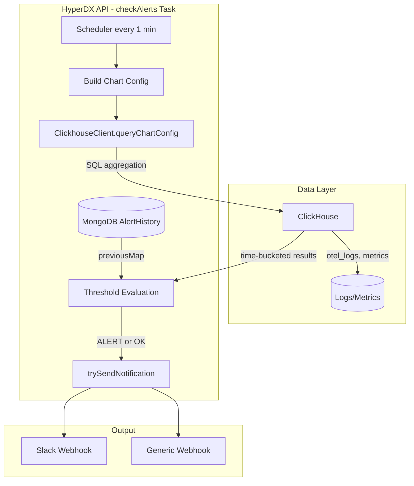
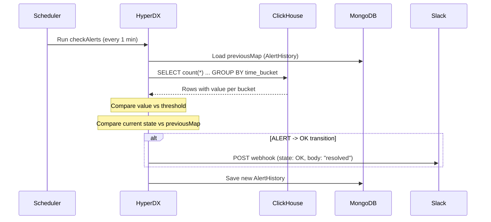

# Deep Study: What Happens When an Alert Resolves (ClickHouse + HyperDX)

## Executive Summary

**ClickHouse does not store or manage alert state.** It is a passive data store. When an alert resolves:

1. **ClickHouse** serves the same aggregation query as before; the result (e.g. count) has changed (e.g. 0 pod restarts).
2. **HyperDX** compares the new result with the previous state (stored in MongoDB), detects an ALERT → OK transition, and sends a resolution webhook.
3. **MongoDB** holds `AlertHistory`; ClickHouse holds only log/metric data (`otel_logs`, etc.).

---

## Architecture: Who Does What




---

## Step-by-Step: Alert Resolution Flow

### 1. Periodic Evaluation (HyperDX)

The `checkAlerts` task runs **every minute** ([index.ts](https://github.com/hyperdxio/hyperdx/blob/main/packages/api/src/tasks/checkAlerts/index.ts) line 1-2). For each alert:

- Computes the evaluation window (e.g. last 5 minutes, aligned to schedule).
- Loads `previousMap` from MongoDB `AlertHistory` (last known state per alert/group).

### 2. Query ClickHouse

HyperDX builds a chart config from the saved search or dashboard tile and runs:

```javascript
const checksData = await clickhouseClient.queryChartConfig({
  config: optimizedChartConfig,
  metadata,
  querySettings: source.querySettings,
});
```

For a pod restart alert, this is typically a query like:

```sql
SELECT toStartOfInterval(timestamp, INTERVAL 5 MINUTE) AS time_bucket,
       count(*) AS value
FROM otel_logs
WHERE ResourceAttributes['telemetry.source'] = 'k8s-events'
  AND Body IN ('Killing', 'BackOff', 'Unhealthy', 'Failed')
  AND timestamp BETWEEN ? AND ?
GROUP BY time_bucket
```

**ClickHouse returns:** Time-bucketed rows with `value` (count). When the issue is fixed, the count for the latest bucket is 0 (or below threshold).

### 3. Threshold Evaluation

For each time bucket in the result:

- If `value` exceeds threshold → `history.state = AlertState.ALERT`, call `trySendNotification({ state: ALERT })`.
- If `value` does not exceed threshold → `history.state = AlertState.OK` (default for new history). No fire notification here.

### 4. Auto-Resolve Detection (Lines 904-921)

After processing all buckets, HyperDX checks for **ALERT → OK** transitions:

```javascript
for (const [groupKey, history] of histories.entries()) {
  const groupPrevious = previousMap.get(previousKey);
  if (
    groupPrevious?.state === AlertState.ALERT &&
    history.state === AlertState.OK
  ) {
    await trySendNotification({
      state: AlertState.OK,
      group: groupKey,
      totalCount: lastValue?.count || 0,
      startTime: lastValue?.startTime || nowInMinsRoundDown,
    });
  }
}
```

**Resolution is triggered when:** The previous run had `ALERT`, the current run has `OK` (because the ClickHouse query returned a count below threshold).

### 5. Resolution Notification

`trySendNotification({ state: AlertState.OK })` flows to `fireChannelEvent` → `renderAlertTemplate` → `notifyChannel`.

In [template.ts](https://github.com/hyperdxio/hyperdx/blob/main/packages/api/src/tasks/checkAlerts/template.ts):

- **Title:** `✅` prefix (vs `🚨` for firing) — line 341.
- **Body:** For resolved alerts, **no ClickHouse sample-log fetch** (lines 418-422):

```javascript
if (isAlertResolved(state)) {
  rawTemplateBody = `${group ? `Group: "${group}" - ` : ''}The alert has been resolved.\n${timeRangeMessage}\n${targetTemplate}`;
}
```

- **Generic webhook:** Receives `state: "OK"` in the Handlebars context (line 266).

---

## What ClickHouse Does vs. Does Not Do


| Aspect                  | ClickHouse                        | HyperDX / MongoDB                                   |
| ----------------------- | --------------------------------- | --------------------------------------------------- |
| **Stores**              | Logs, metrics (`otel_logs`, etc.) | Alert definitions, `AlertHistory` (state per group) |
| **Evaluates threshold** | No                                | Yes (in Node.js)                                    |
| **Detects resolution**  | No                                | Yes (compares current result with `previousMap`)    |
| **Sends webhooks**      | No                                | Yes                                                 |
| **Resolution message**  | N/A                               | "The alert has been resolved." + time range         |


---

## Data Flow Summary




---

## Key Takeaways

1. **ClickHouse is stateless for alerts.** It only returns query results; it does not track alert state or resolution.
2. **Resolution = query result below threshold + previous state was ALERT.** Both conditions are evaluated in HyperDX.
3. **Resolution notifications do not query ClickHouse for sample logs.** The body is a fixed string; only firing alerts fetch sample logs.
4. **Alert history lives in MongoDB**, not ClickHouse. The `previousMap` is built from `AlertHistory.aggregate()`.

