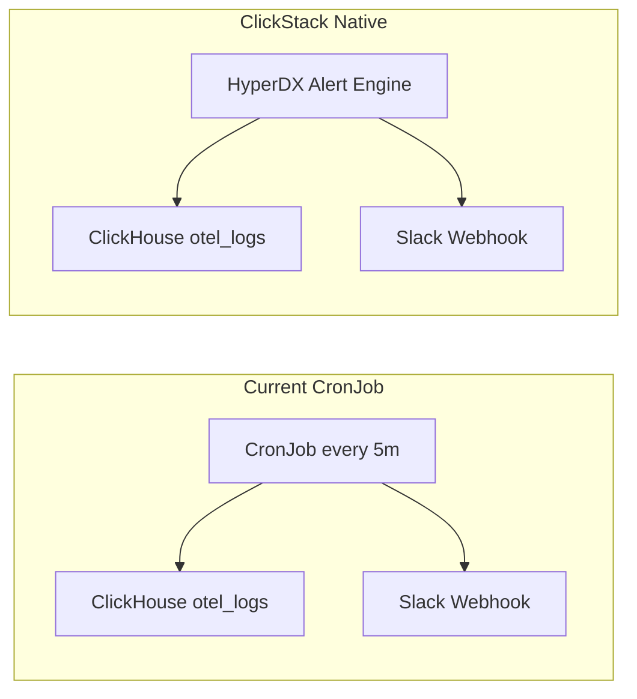

# Pod Restart Alert via ClickHouse/HyperDX Native Alerts

## Current State

The observability stack uses [ClickStack](https://clickhouse.com/docs/use-cases/observability/clickstack) (ClickHouse + HyperDX) and has a **CronJob-based** pod restart alert in `[pod-restart-alert/](observability-stack/pod-restart-alert/)` that:

- Queries ClickHouse `otel_logs` every 5 minutes
- Posts to Slack via webhook when pod restart events (Killing, BackOff, Unhealthy, Failed) are found

## Target: Slack Channel and Workspace

**Both ClickHouse alerts and the Autopilot agent must target:**

- **Slack channel:** `#krateo-troubleshooting`
- **Slack workspace:** `aiagents-gruppo`

When creating the Slack webhook (HyperDX or incoming webhook), configure it to post to `#krateo-troubleshooting` in the `aiagents-gruppo` workspace. The KAgent Slack bot must be invited to the same channel.

## Target State: ClickStack Native Alerts

ClickStack/HyperDX provides built-in alerting that:

- Uses **Search alerts** (count of events matching a saved search) or **Dashboard chart alerts**
- Integrates with Slack via webhooks
- Evaluates on configurable intervals (1m, 5m, 15m, etc.)




## Implementation Plan

### 1. Remove CronJob-Based Alert

- Delete or deprecate `[pod-restart-alert/cronjob.yaml](observability-stack/pod-restart-alert/cronjob.yaml)`, `[configmap.yaml](observability-stack/pod-restart-alert/configmap.yaml)`, and `[secret.yaml.example](observability-stack/pod-restart-alert/secret.yaml.example)`
- Remove Phase 7 from `[install.sh](observability-stack/install.sh)`

### 2. Document HyperDX UI Workflow

Update `[pod-restart-alert/README.md](observability-stack/pod-restart-alert/README.md)` with step-by-step instructions:

**Step 1: Create Slack Webhook in HyperDX**

- Open HyperDX UI (e.g. `http://<hyperdx-ip>:3000`)
- Go to Alerts / Integrations / Webhooks
- Add webhook: service type `slack`, paste Slack incoming webhook URL
- **Target channel:** Create the webhook in the Slack workspace `aiagents-gruppo` and configure it to post to `#krateo-troubleshooting`
- Note the webhook ID (or use it when creating the alert)

**Step 2: Create Saved Search for Pod Restart Events**

- Go to Search
- Use SQL mode with query filter:

```sql
  ResourceAttributes['telemetry.source'] = 'k8s-events'
  AND JSONExtractString(Body, 'object', 'involvedObject', 'kind') = 'Pod'
  AND JSONExtractString(Body, 'object', 'reason') IN ('Killing', 'BackOff', 'Unhealthy', 'Failed')
  

```

- Save the search (e.g. "Pod Restart Events")

**Step 3: Add Alert to the Saved Search**

- Click Alerts on the saved search
- Threshold: above 0
- Interval: 5m (or 1m for faster detection)
- Channel: select the Slack webhook created in Step 1
- Name: "Pod Restart Alert"
- **Message:** Include an @mention of the KAgent Slack bot so it is tagged and takes charge of troubleshooting. Example: `Pod restart detected in cluster. <@BOT_USER_ID> please investigate and fix.` (Replace `BOT_USER_ID` with the bot's Slack user ID from the app settings.)

### 3. Optional: API Bootstrap Script

If the HyperDX API supports creating webhooks (current API has GET only for webhooks), provide a bootstrap script. Otherwise, create a script that:

- Takes `HYPERDX_API_KEY`, `WEBHOOK_ID`, `SOURCE_ID` as input (user creates webhook in UI first, gets sourceId via `GET /api/v2/sources`)
- Creates dashboard with a tile that counts pod restart events
- Creates alert on that tile via `POST /api/v2/alerts`

**Dependency**: HyperDX has no public `POST /api/v2/webhooks` in the OpenAPI spec. Webhook must be created in UI. The script would document this and accept webhookId as a parameter.

### 4. Update Observability Stack README

- In `[README.md](observability-stack/README.md)`, replace Phase 7 with instructions for creating the alert in HyperDX
- Keep the KAgent Slack integration docs (same channel, @mention to investigate)

### 5. KAgent Integration

The `[manifests/slack-integration/README.md](autopilot-kagent/autopilot/manifests/slack-integration/README.md)` must specify:

- **Target channel:** `#krateo-troubleshooting` in workspace `aiagents-gruppo`
- Add the KAgent Slack bot to `#krateo-troubleshooting` so it receives @mentions when the alert fires
- **Agent chain:** The bot should invoke:
  1. **Observability Agent** – diagnoses via ClickHouse (pod logs, K8s events, metrics)
  2. **k8s-agent** ([kagent.dev/agents/k8s-agent](https://kagent.dev/agents/k8s-agent)) – executes remediation (ApplyManifest, PatchResource, DeleteResource, GetPodLogs, ExecuteCommand, etc.)
  3. **helm-agent** ([kagent.dev/agents/helm-agent](https://kagent.dev/agents/helm-agent)) – troubleshoots Helm charts (ListReleases, GetRelease, Upgrade, Uninstall, RepoAdd, RepoUpdate) for chart config, upgrades, rollbacks, and release issues

Integrate k8s-agent and helm-agent as sub-agents or route to them when the user/bot requests remediation or Helm-related fixes.

## Search Query for Pod Restart Events

HyperDX supports Lucene and SQL `where` syntax. The filter for pod restart events:

**SQL mode:**

```sql
ResourceAttributes['telemetry.source'] = 'k8s-events'
AND JSONExtractString(Body, 'object', 'involvedObject', 'kind') = 'Pod'
AND JSONExtractString(Body, 'object', 'reason') IN ('Killing', 'BackOff', 'Unhealthy', 'Failed')
```

**Lucene mode** (if supported for nested fields):

```
ResourceAttributes.telemetry.source:k8s-events
```

Note: Lucene may not support JSONExtractString. SQL mode is preferred.

## Files to Modify


| File                                                        | Action                                                                                         |
| ----------------------------------------------------------- | ---------------------------------------------------------------------------------------------- |
| `observability-stack/pod-restart-alert/cronjob.yaml`        | Delete                                                                                         |
| `observability-stack/pod-restart-alert/configmap.yaml`      | Delete                                                                                         |
| `observability-stack/pod-restart-alert/secret.yaml.example` | Delete                                                                                         |
| `observability-stack/pod-restart-alert/README.md`           | Rewrite for HyperDX UI workflow; specify target `#krateo-troubleshooting` in `aiagents-gruppo` |
| `observability-stack/install.sh`                            | Remove Phase 7 (CronJob deploy)                                                                |
| `observability-stack/README.md`                             | Update Phase 7 to HyperDX alert instructions                                                   |
| `autopilot-kagent/manifests/slack-integration/README.md`    | Specify target channel `#krateo-troubleshooting`, workspace `aiagents-gruppo`                  |


## Alert Lifecycle: Fire vs. Recovery Notifications (HyperDX Source Analysis)

HyperDX **does send a second webhook when the alert resolves**. This is implemented in the [checkAlerts task](https://github.com/hyperdxio/hyperdx/blob/main/packages/api/src/tasks/checkAlerts/index.ts).

### When the alert fires (ALERT state)

1. The task evaluates the saved search / chart against the threshold every interval.
2. If the count exceeds the threshold, it creates an `AlertHistory` with `state: ALERT`.
3. It calls `trySendNotification({ state: AlertState.ALERT, ... })` -> `fireChannelEvent` -> `renderAlertTemplate` -> `notifyChannel`.
4. **Slack webhook** receives a message with title prefix 🚨 and the alert body (e.g. sample logs, count).
5. **Generic webhook** receives a JSON body with template vars: `state: "ALERT"`, `title`, `body`, `link`, `startTime`, `endTime`, `eventId`.

### When the alert resolves (OK state)

1. On the next evaluation, if the count drops below the threshold, the task detects a transition from `ALERT` -> `OK` (lines 679-693 in `index.ts`).
2. It calls `trySendNotification({ state: AlertState.OK, ... })` with the same channel flow.
3. **Slack webhook** receives a second message with title prefix ✅ and body: `"The alert has been resolved."` + time range ([template.ts](https://github.com/hyperdxio/hyperdx/blob/main/packages/api/src/tasks/checkAlerts/template.ts) lines 418-422).
4. **Generic webhook** receives `state: "OK"` in the template vars; the body can be customized via Handlebars to show different content for resolved vs. firing.

### Summary


| Event       | Webhook sent? | Title prefix | Body (saved search)                         |
| ----------- | ------------- | ------------ | ------------------------------------------- |
| **Fire**    | Yes           | 🚨           | Count + sample logs + time range            |
| **Resolve** | Yes           | ✅            | "The alert has been resolved." + time range |


No extra integration is needed for recovery notifications; HyperDX sends them automatically.

## Clarification

The HyperDX API exposes `GET /api/v2/webhooks` but no `POST` for creating webhooks. Webhooks must be created in the UI. The alert can be created via `POST /api/v2/alerts` if we have `savedSearchId` (from UI) or `dashboardId`+`tileId` (from API). A bootstrap script could create a dashboard + tile + alert via API, but would still require the user to create the webhook in the UI first and pass `webhookId`. The primary path will be the full UI workflow; an optional script can automate dashboard + alert creation given webhookId and sourceId.