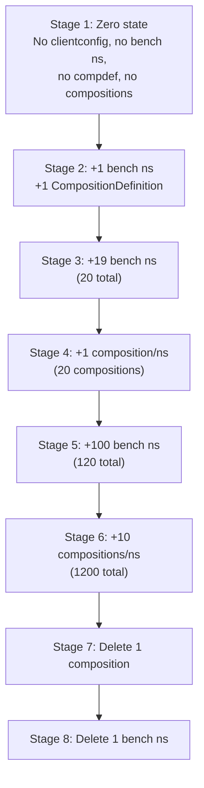
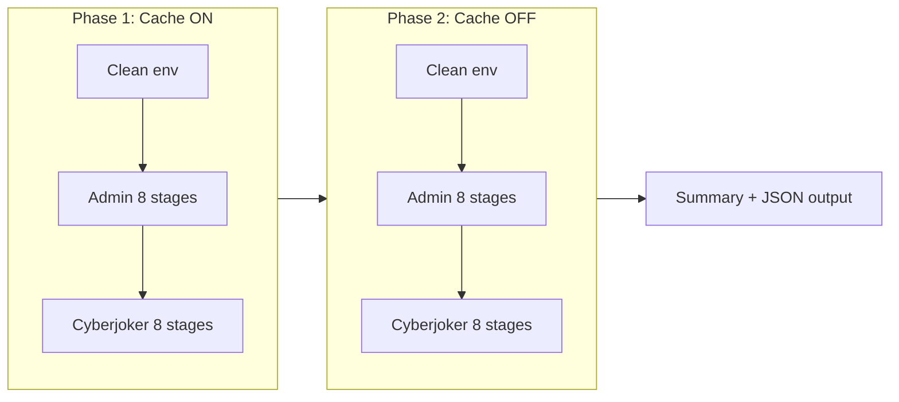

# Snowplow Full Cache Matrix Test

## Context

The existing `[e2e/bench/cache_matrix_test.py](e2e/bench/cache_matrix_test.py)` has 6 stages and toggles cache by adding/removing the Redis sidecar. The new test will:

- Use the `CACHE_ENABLED` env var (patched on the deployment) instead of sidecar manipulation -- cleaner and explicitly requested
- Add 8 stages matching the user's exact scenario (including **delete** operations, which don't exist in any current test)
- Capture snowplow pod logs and `/metrics/cache` response at every stage transition
- Run the full 8-stage sequence for **admin**, then re-run the same sequence for **cyberjoker** (RBAC testing)
- Execute the entire matrix twice: once with cache ON, once with cache OFF

## File to Create

`**[e2e/bench/full_matrix_test.py](e2e/bench/full_matrix_test.py)`** -- Python 3 script. Dependencies: `playwright` (for browser-level measurements). A `requirements.txt` will be added to `e2e/bench/`.

## Test Stages




Each stage executes: **setup action** -> **wait for propagation** -> **measure endpoints** (cold + warm, N iterations) -> **capture logs + metrics**.

## Cache Toggle via Env Var

Instead of the existing sidecar add/remove approach in `cache_matrix_test.py` lines 357-391, the new test will patch the `CACHE_ENABLED` env var directly on the snowplow container:

```python
def enable_cache():
    kubectl("set", "env", "deployment/snowplow", "-n", NS,
            "-c", "snowplow", "CACHE_ENABLED=true")
    kubectl("rollout", "restart", "deployment/snowplow", "-n", NS)
    kubectl("rollout", "status", "deployment/snowplow", "-n", NS, "--timeout=300s")
    wait_for_snowplow(extra=5)

def disable_cache():
    kubectl("set", "env", "deployment/snowplow", "-n", NS,
            "-c", "snowplow", "CACHE_ENABLED=false")
    kubectl("rollout", "restart", "deployment/snowplow", "-n", NS)
    kubectl("rollout", "status", "deployment/snowplow", "-n", NS, "--timeout=300s")
    wait_for_snowplow()
```

## New Delete Operations (Stages 7 and 8)

No existing test covers deletions. Two new helper functions:

- `delete_one_composition(ns, name)` -- `kubectl delete` a single `GithubScaffoldingWithCompositionPage`
- `delete_one_bench_namespace(ns)` -- `kubectl delete ns` a single bench namespace (which cascades its compositions)

## Per-Stage Monitoring

At each stage boundary, capture and store:

- **API response times**: cold (1st request) + warm (p50, p90, mean over `ITERS` iterations) for all 5 dashboard endpoints (same as existing test lines 46-56: compositions page, comp-list RESTAction, comp-piechart widget, dashboard page, sidebar navmenu)
- **Browser metrics** (Playwright): for each stage, automate the real Krateo frontend:
  - Login as the current user (admin or cyberjoker) via the frontend login page
  - Navigate to the dashboard page
  - Capture Navigation Timing API metrics: `TTFB`, `domContentLoaded`, `loadComplete`, `domInteractive`
  - Count total network requests and their aggregate transfer size
  - Measure total page load wall-clock time (from `navigationStart` to `loadEventEnd`)
  - Take a screenshot saved to `/tmp/screenshots/{cache_mode}_{user}_stage{N}.png` for visual comparison
- **Snowplow logs**: last 100 lines from `kubectl logs deployment/snowplow -c snowplow` -- parsed for key signals (`L1 warmup`, cache hit/miss counts, error lines)
- **Cache metrics**: GET `/metrics/cache` endpoint response
- **Cluster state**: count of bench namespaces and compositions at measurement time

## Browser Measurement Implementation

Playwright is used in synchronous mode (`playwright.sync_api`). A single browser instance is reused across stages; a fresh `BrowserContext` is created per user per stage to simulate a clean "refresh" (no stale cookies/cache).

```python
from playwright.sync_api import sync_playwright

def measure_browser(frontend_url, username, password, stage_label, cache_mode):
    with sync_playwright() as p:
        browser = p.chromium.launch(headless=True)
        context = browser.new_context()
        page = context.new_page()

        # Login
        page.goto(f"{frontend_url}/login")
        page.fill('input[name="username"]', username)
        page.fill('input[name="password"]', password)
        page.click('button[type="submit"]')
        page.wait_for_url("**/dashboard**", timeout=30000)

        # Navigate to dashboard (simulates "refresh")
        page.goto(f"{frontend_url}/dashboard")
        page.wait_for_load_state("networkidle")

        # Collect Navigation Timing
        timing = page.evaluate("""() => {
            const t = performance.getEntriesByType('navigation')[0];
            return {
                ttfb: t.responseStart - t.requestStart,
                domContentLoaded: t.domContentLoadedEventEnd - t.startTime,
                domInteractive: t.domInteractive - t.startTime,
                loadComplete: t.loadEventEnd - t.startTime,
            };
        }""")

        # Network stats
        network = page.evaluate("""() => {
            const entries = performance.getEntriesByType('resource');
            return {
                requestCount: entries.length,
                totalTransferKB: Math.round(
                    entries.reduce((s, e) => s + (e.transferSize || 0), 0) / 1024
                ),
            };
        }""")

        # Screenshot
        path = f"/tmp/screenshots/{cache_mode}_{username}_stage{stage_label}.png"
        page.screenshot(path=path, full_page=True)

        context.close()
        browser.close()
        return {**timing, **network, "screenshot": path}
```

The browser launch is kept outside the timing loop (only the navigation is measured). The function returns a dict that gets merged into the per-stage results.

For the **warm** browser pass, the same flow is repeated `ITERS` times (reusing the same browser context to keep session state) and p50/p90 of `loadComplete` are reported.

## Execution Flow




For cyberjoker: the environment state is NOT reset between admin and cyberjoker runs. Cyberjoker runs against the **same** 8-stage build-up to test RBAC filtering at every scale point. The `setup_cyberjoker_rbac()` helper from the existing test (lines 327-354) gives cyberjoker read-only access in `demo-system` only.

## Output

- Live console output with color-coded stage headers, timing, HTTP status
- JSON results file at `/tmp/full_matrix_results.json` with all measurements (API + browser)
- Screenshots saved to `/tmp/screenshots/` (one per stage per user per cache mode)
- Final summary table comparing cache ON vs OFF for both users across all 8 stages, including both API-level and browser-level metrics side by side

## Key Code to Reuse from Existing Test

From `[e2e/bench/cache_matrix_test.py](e2e/bench/cache_matrix_test.py)`:

- `kubectl()`, `login()`, `http_get()`, `pct()` helpers (lines 80-127)
- `ENDPOINTS` list (lines 45-56)
- `USERS` dict (lines 40-43)
- `wait_for_snowplow()`, `wait_for_l1_warmup()` (lines 129-159)
- `create_bench_namespaces()`, `deploy_compositiondefinition()`, `deploy_compositions()`, `composition_yaml()` (lines 212-324)
- `setup_cyberjoker_rbac()` (lines 327-354)
- `get_cache_metrics()`, `get_snowplow_log_tail()` (lines 162-174)

## Configurable Env Vars

- `SNOWPLOW_URL` -- snowplow base URL
- `AUTHN_URL` -- authn service URL
- `FRONTEND_URL` -- Krateo frontend URL for browser measurements (e.g. `http://34.x.x.x:3000`)
- `ITERS` -- warm measurement iterations (default 5)
- `BROWSER_HEADLESS` -- set to `0` to run Playwright in headed mode for debugging (default `1`)

## Dependencies

A new `e2e/bench/requirements.txt` will be created:

```
playwright>=1.40
```

Pre-run setup: `pip install -r e2e/bench/requirements.txt && playwright install chromium`

