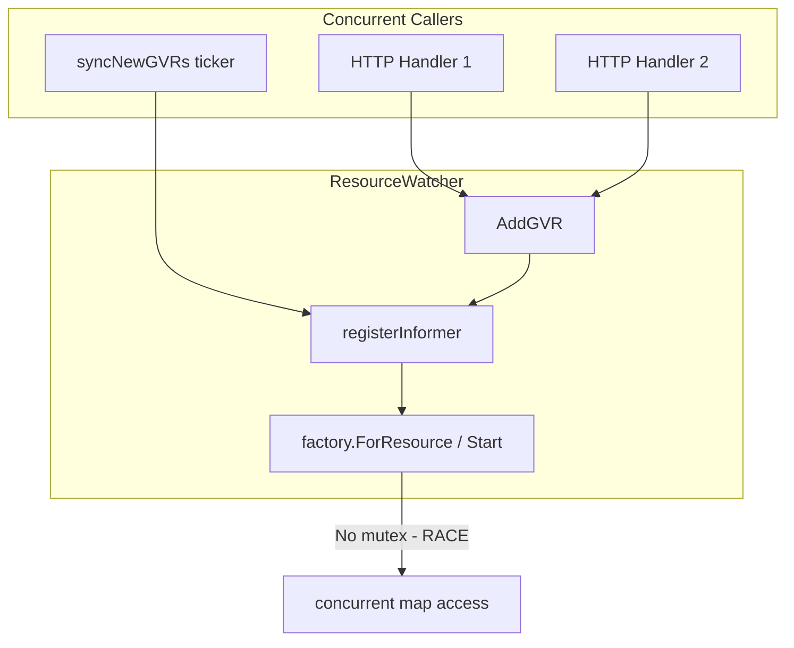

# Snowplow Concurrent Map Race Fix

## Root Cause

The error `fatal error: concurrent map iteration and map write` occurs when one goroutine iterates a map while another writes to it. Under heavy load (e.g., 119 bench namespaces), the crash manifests in the RESTAction resolver / RBAC watcher path.

**Most likely culprit**: The `ResourceWatcher` calls `AddGVR` from many concurrent HTTP handlers (via `SAddGVR` -> `onNewGVR` -> `resourceWatcher.AddGVR`). Each `AddGVR` invokes `factory.ForResource(gvr)` and `factory.Start()`. The client-go `DynamicSharedInformerFactory` uses internal maps; concurrent `ForResource`/`Start` calls from multiple goroutines can trigger the race.

**Current protection gap**: In [internal/cache/watcher.go](snowplow/internal/cache/watcher.go), `registerInformer` holds `rw.mu` only for the `watched` map check (lines 143-148). The `factory.ForResource`, `AddEventHandler`, and `factory.Start` run **outside** the lock, allowing concurrent modification of the factory's internal state.




## Proposed Fix

### 1. Extend mutex coverage in ResourceWatcher (primary fix)

In [internal/cache/watcher.go](snowplow/internal/cache/watcher.go):

- Hold `rw.mu` for the **entire** `registerInformer` body, including `factory.ForResource`, `AddEventHandler`, and the `factory.Start` call in `startInformer`.
- Hold `rw.mu` in `syncNewGVRs` when calling `registerInformer` and `factory.Start`.

This serializes all operations that touch the dynamic informer factory, eliminating the race.

**Changes**:

- In `registerInformer`: Keep the lock from the start until after `AddEventHandler` (and before returning). Move `factory.Start` into the locked section when called from `startInformer`, or ensure `startInformer` holds the lock when calling `factory.Start`.
- In `syncNewGVRs`: Wrap the loop that calls `registerInformer` and the subsequent `factory.Start` in `rw.mu.Lock()`/`Unlock()`.

**Caveat**: Holding the lock during `AddEventHandler` and `factory.Start` may add latency under high GVR churn. If needed, we can narrow the critical section to only `factory.ForResource` + `factory.Start` (the factory mutation), and keep `AddEventHandler` outside if it does not touch shared maps.

### 2. Serialize AddGVR at the RedisCache layer (defensive)

In [internal/cache/redis.go](snowplow/internal/cache/redis.go), add a mutex around the `onNewGVR` callback in `SAddGVR` so that only one GVR registration runs at a time. This provides a second line of defense if the factory has other unsynchronized paths.

```go
// In RedisCache struct, add:
gvrNotifyMu sync.Mutex

// In SAddGVR, when calling onNewGVR:
if added > 0 && c.onNewGVR != nil {
    c.gvrNotifyMu.Lock()
    c.onNewGVR(ctx, gvr)
    c.gvrNotifyMu.Unlock()
}
```

### 3. Run `go test -race` and verify

After applying the fix, run the test suite with the race detector to confirm no races remain:

```bash
cd /Users/diegobraga/krateo/snowplow-cache/snowplow && go test -race ./...
```

## Implementation Order

1. **Primary**: Extend `rw.mu` in `watcher.go` to cover `registerInformer` and `syncNewGVRs` factory access.
2. **Defensive**: Add `gvrNotifyMu` in `redis.go` for `SAddGVR` callback.
3. **Verify**: Run `go test -race ./...`.

## Files to Modify


| File                                                            | Change                                                                               |
| --------------------------------------------------------------- | ------------------------------------------------------------------------------------ |
| [internal/cache/watcher.go](snowplow/internal/cache/watcher.go) | Extend `rw.mu` to cover full `registerInformer` and `syncNewGVRs` factory operations |
| [internal/cache/redis.go](snowplow/internal/cache/redis.go)     | Add `gvrNotifyMu` around `onNewGVR` in `SAddGVR`                                     |


## Operational Mitigation (already noted)

- **Immediate**: Remove bench namespaces to reduce load (`kubectl delete ns bench-`* or equivalent).
- **Test**: Re-run the full matrix test after the fix and confirm Snowplow remains stable.

